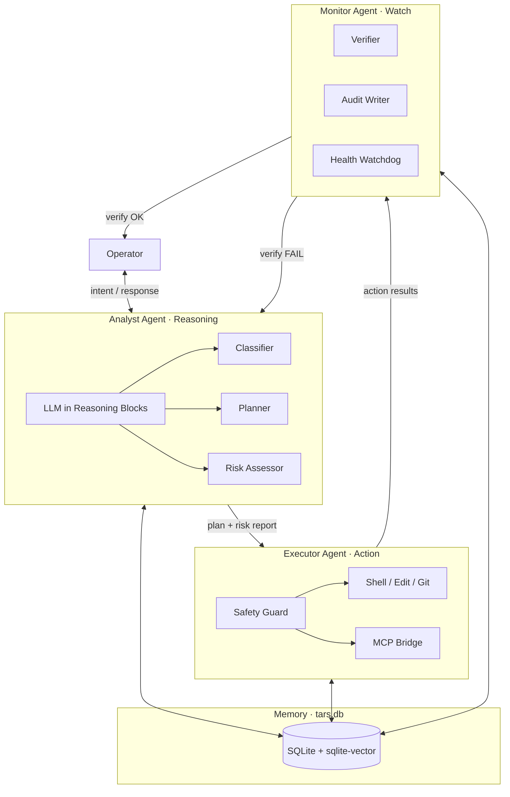
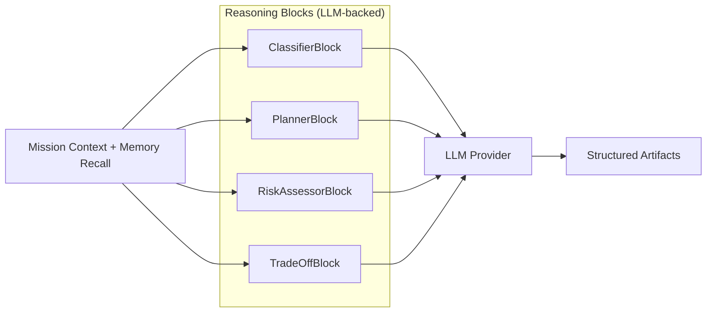
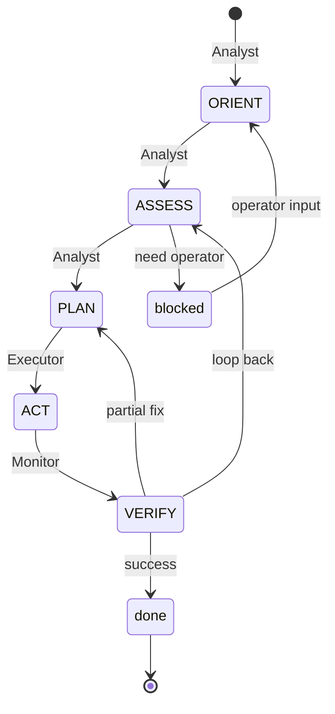

# T.A.R.S. General Architecture

**Language:** **English** | [Tiếng Việt](../vi/architecture.md)

This document describes the **general architecture** of tars: a tactical autonomous agent inspired by T.A.R.S. from *Interstellar*. It defines layers, the **tri-agent model**, memory, data flow, and extension points.

[← Index](./README.md) · [Parameters](./parameters.md) · [Behavior](./behavior.md) · [Problem-Solving](./problem-solving.md)

---

## 1. Design Goals

| Goal | Source (Interstellar) | Architectural implication |
|------|----------------------|---------------------------|
| **Honest assessment** | *"What's your honesty parameter?"* | Parameter engine + risk disclosure in Analyst Agent |
| **Tactical partnership** | Cooper ↔ T.A.R.S. crew dynamic | Operator layer, not master/slave |
| **Modularity** | T.A.R.S. disassembles into blocks | Pluggable capability blocks per agent |
| **Mission focus** | Endurance survival | Mission controller with priority stack |
| **Necessary sacrifice** | Black hole push | Trade-off engine in Analyst Agent |
| **Hard safety limits** | Obedience with boundaries | Safety guard on Executor Agent |
| **Crew complement** | T.A.R.S. + CASE | Tri-agent: Analyst · Executor · Monitor |

---

## 2. Locked Architecture Decisions

| # | Decision | Choice |
|---|----------|--------|
| 1 | **LLM placement** | Inside **Reasoning blocks** of the Analyst Agent — not a top-level orchestrator |
| 2 | **Memory backend** | **File-based SQLite** with [sqlite-vector](https://github.com/sqliteai/sqlite-vector) extension for semantic recall |
| 3 | **Agent topology** | **Tri-agent crew**: Analyst (reasoning) · Executor (action) · Monitor (observability) |

Still open: block isolation (in-process vs. subprocess vs. WASM).

---

## 3. Tri-Agent Model

Inspired by T.A.R.S. and CASE operating as distinct crew members on Endurance — specialized roles, shared mission, coordinated handoffs.



### 3.1 Role mapping

| Agent | Vietnamese | Cognitive phases | Responsibility |
|-------|------------|------------------|----------------|
| **Analyst** | Phân tích / Lý luận | ORIENT · ASSESS · PLAN | Understand problem, assess risk, produce plan |
| **Executor** | Thực thi | ACT | Run approved actions through Safety Guard |
| **Monitor** | Theo dõi | VERIFY (+ continuous) | Verify outcomes, audit, detect drift, loop back |

### 3.2 Agent contracts

```
AnalystAgent {
  input:   OperatorIntent | MonitorFeedback
  output:  PlanArtifact | RiskReport | BlockedRequest
  llm:     embedded in Reasoning blocks only
}

ExecutorAgent {
  input:   ApprovedPlan
  output:  ActionResult[]
  guard:   SafetyGuard (mandatory)
}

MonitorAgent {
  input:   ActionResult[] | MissionState
  output:  VerifyReport | Alert | LoopBackSignal
  write:   audit_log, episodic_memory (always)
}
```

### 3.3 Handoff protocol

```
1. Analyst  → ORIENT/ASSESS/PLAN  → writes artifacts to memory
2. Operator approves plan (if risk disclosure requires)
3. Executor → ACT                 → Safety Guard → external world
4. Monitor  → VERIFY              → test, lint, diff review
5. Monitor  → done                → handoff to Operator
              fail                → LoopBackSignal → Analyst (ASSESS)
```

**Rule:** Executor never plans. Analyst never executes without Monitor's audit trail slot reserved. Monitor never mutates workspace — read-only + verify only.

---

## 4. High-Level Overview

```
┌─────────────────────────────────────────────────────────────┐
│  L4  Operator Layer          Human · IDE · API · Webhook    │
├─────────────────────────────────────────────────────────────┤
│  L3  Policy Layer            Parameters · Behavior · Safety │
├─────────────────────────────────────────────────────────────┤
│  L2  Cognitive Layer         Mission Controller · Bus       │
├─────────────────────────────────────────────────────────────┤
│  L1  Tri-Agent Layer         Analyst · Executor · Monitor   │
├─────────────────────────────────────────────────────────────┤
│  L0  Infrastructure          SQLite + sqlite-vector · I/O   │
└─────────────────────────────────────────────────────────────┘
```

| Layer | Key components |
|-------|----------------|
| **L4 Operator** | Cursor chat, CLI, HTTP API, SDK client |
| **L3 Policy** | Parameter engine, behavior rules, Safety Guard rules |
| **L2 Cognitive** | Mission controller, agent bus, trade-off resolver |
| **L1 Tri-Agent** | Analyst (LLM reasoning), Executor (action), Monitor (verify) |
| **L0 Infrastructure** | `tars.db`, file workspace, process runner, MCP transport |

---

## 5. Analyst Agent — LLM in Reasoning Blocks

The LLM is **not** a separate orchestrator. It lives inside Reasoning blocks invoked during ORIENT, ASSESS, and PLAN.



### Reasoning block contract

```
ReasoningBlock {
  id:       string
  phase:    orient | assess | plan
  llm:      LLMConfig { model, temperature, max_tokens }
  prompt:   template + injected memory chunks + parameters
  output:   JSON schema (strict)   // plan steps, risk levels, classification
  invoke(ctx, input) → BlockResult
}
```

| Block | Phase | LLM task | Output schema |
|-------|-------|----------|---------------|
| **ClassifierBlock** | ORIENT, ASSESS | Symptom vs root cause, problem type | `{ type, severity, hypothesis[] }` |
| **RiskAssessorBlock** | ASSESS | Honest odds, blast radius | `{ risk, level, mitigation, alternative }` |
| **PlannerBlock** | PLAN | Minimal step list, Plan A/B | `{ steps[], rollback, contingencies[] }` |
| **TradeOffBlock** | PLAN | Necessary sacrifice options | `{ options[{ cost, benefit }] }` |

**Design rules:**

- Perception blocks (file read, grep) are **non-LLM** — they feed structured context into Reasoning blocks.
- LLM calls inherit **Parameter Engine** values (honesty, verbosity) in prompt assembly.
- Structured output only — no free-form LLM text reaches Executor directly.
- One LLM provider interface; blocks select model profile per task (e.g. fast classify vs. deep plan).

---

## 6. Executor Agent

Receives **ApprovedPlan** artifacts only. No LLM in the default execution path.

| Block | Role |
|-------|------|
| **ShellRunner** | Run commands, capture stdout/stderr |
| **FileEditor** | Apply minimal diffs |
| **GitOps** | status, diff, commit (on operator request) |
| **MCPBridge** | External tools via MCP |

Every action passes **Safety Guard** (P5 hard boundaries) before execution. Denied actions emit `BlockedAction` → Monitor logs → Analyst reassesses.

```
ExecutorAgent.execute(plan) {
  for step in plan.steps {
    action = materialize(step)
    verdict = SafetyGuard.evaluate(action)
    match verdict {
      Allow  → run → ActionResult
      Deny   → BlockedAction → break → Monitor
    }
  }
}
```

---

## 7. Monitor Agent

Continuous **observer** — like CASE monitoring ship systems while T.A.R.S. acts.

| Block | Role |
|-------|------|
| **VerifierBlock** | Run tests, lint, reproduce bug |
| **AuditWriter** | Append immutable audit_log rows |
| **HealthWatchdog** | Mission timeout, stuck loop, parameter drift |
| **HandoffBuilder** | Final summary for Operator (Rule V2) |

### Loop-back triggers

| Signal | Target | Reason |
|--------|--------|--------|
| Test fail | Analyst → ASSESS | Wrong hypothesis |
| Partial fix | Analyst → PLAN | Adjust steps |
| Safety deny | Analyst → ASSESS | Re-plan safer path |
| 3× same failure | Operator | Rule: stuck escalation |
| Incident detected | Parameter Engine | humor↓, initiative↑ |

Monitor is **read-only** on workspace except running verify commands explicitly listed in the plan.

---

## 8. Memory — SQLite + sqlite-vector

Persistent memory is a **single file per workspace**: `.tars/tars.db`

Uses [sqlite-vector](https://github.com/sqliteai/sqlite-vector) — vector search inside ordinary SQLite tables, no external server, edge-ready, ~30MB default RAM footprint.

### 8.1 Why sqlite-vector

| Property | Benefit for tars |
|----------|------------------|
| File-based | Portable with repo; gitignore-able |
| No preindexing | Write memories immediately after each turn |
| BLOB in ordinary tables | Simple schema alongside relational audit data |
| TurboQuant | Compact embeddings for long mission histories |
| Offline | No cloud dependency for recall |

### 8.2 Schema (conceptual)

```sql
-- Mission & artifacts (relational)
CREATE TABLE missions (
  id          TEXT PRIMARY KEY,
  goal        TEXT NOT NULL,
  status      TEXT NOT NULL,  -- orient|assess|plan|act|verify|done|blocked
  priority    TEXT NOT NULL,
  created_at  INTEGER NOT NULL,
  updated_at  INTEGER NOT NULL
);

CREATE TABLE artifacts (
  id          INTEGER PRIMARY KEY,
  mission_id  TEXT NOT NULL REFERENCES missions(id),
  phase       TEXT NOT NULL,
  agent       TEXT NOT NULL,  -- analyst|executor|monitor
  kind        TEXT NOT NULL,  -- plan|risk|action_result|verify_report
  payload     TEXT NOT NULL,  -- JSON
  created_at  INTEGER NOT NULL
);

-- Semantic memory (vector)
CREATE TABLE episodic_memory (
  id          INTEGER PRIMARY KEY,
  mission_id  TEXT,
  agent       TEXT NOT NULL,
  content     TEXT NOT NULL,
  embedding   BLOB,             -- float32 vector
  meta        TEXT,             -- JSON: tags, file paths, outcome
  created_at  INTEGER NOT NULL
);

SELECT vector_init('episodic_memory', 'embedding',
  'type=FLOAT32,dimension=384,distance=COSINE');

-- Audit (append-only)
CREATE TABLE audit_log (
  id          INTEGER PRIMARY KEY,
  mission_id  TEXT NOT NULL,
  agent       TEXT NOT NULL,
  event       TEXT NOT NULL,    -- action_started|action_denied|verify_pass|...
  detail      TEXT NOT NULL,
  created_at  INTEGER NOT NULL
);

-- Agent bus events
CREATE TABLE agent_events (
  id          INTEGER PRIMARY KEY,
  mission_id  TEXT NOT NULL,
  from_agent  TEXT NOT NULL,
  to_agent    TEXT NOT NULL,
  event_type  TEXT NOT NULL,    -- plan_ready|action_done|verify_fail|loop_back
  payload     TEXT NOT NULL,
  created_at  INTEGER NOT NULL
);
```

### 8.3 Memory operations

| Operation | Agent | When |
|-----------|-------|------|
| **recall(query, k)** | Analyst | ORIENT — semantic search over `episodic_memory` |
| **write_episode(text, embedding)** | All | End of each phase |
| **write_artifact(json)** | All | After each block output |
| **append_audit(event)** | Monitor | Every action + verify |
| **publish_bus(event)** | All | Agent handoffs |

Example recall (Analyst at ORIENT):

```sql
SELECT e.id, e.content, v.distance
FROM episodic_memory AS e
JOIN vector_quantize_scan('episodic_memory', 'embedding', ?, 10) AS v
  ON e.id = v.rowid
WHERE e.meta LIKE '%"project":"tars"%'
ORDER BY v.distance
LIMIT 5;
```

Recommended: `qtype=TURBO,qbits=4` for recall-heavy workloads (best recall/speed trade-off per sqlite-vector docs).

### 8.4 Memory tiers

| Tier | Store | Lifetime |
|------|-------|----------|
| **Turn buffer** | In-memory | Single turn |
| **Mission context** | `artifacts` table | Mission lifetime |
| **Episodic memory** | `episodic_memory` + vectors | Persistent, searchable |
| **Audit trail** | `audit_log` | Immutable, persistent |
| **Session params** | In-memory + optional `session` table | Session lifetime |

---

## 9. End-to-End Data Flow

```
1. Operator → Interface Adapter
2. Mission Controller → create/load mission in tars.db
3. Parameter Engine → resolve effective parameters
4. Analyst Agent
      recall(episodic_memory) → Perception blocks → Reasoning blocks (LLM)
      → write artifacts + episodic_memory
      → publish plan_ready → agent_events
5. [Operator approval if required]
6. Executor Agent
      read plan artifact → Safety Guard → Action blocks
      → write action results → publish action_done
7. Monitor Agent
      Verifier blocks → AuditWriter → HandoffBuilder
      → pass: verify_pass → Operator
      → fail: loop_back → Analyst
8. Communication layer formats response (verbosity, humor, honesty)
9. Interface Adapter → Operator
```

---

## 10. Mission Controller & Cognitive Loop

Mission state lives in `missions` + drives which agent is active.



One **active mission** at a time (Rule O2). Agent bus events in `agent_events` provide full replay.

---

## 11. Integration Surfaces

| Surface | Maps to |
|---------|---------|
| Cursor rules / AGENTS.md | L3 Policy |
| System prompt | L3 + Analyst Reasoning prompts |
| MCP servers | Executor MCPBridge |
| Cursor SDK | L4 adapter → tri-agent runtime |
| CLI | L4 headless operator |
| `.tars/tars.db` | L0 memory (portable per workspace) |

---

## 12. Proposed Repository Layout

```
tars/
├── docs/
├── core/
│   ├── mission/           # Mission controller
│   └── bus/               # Agent event bus
├── agents/
│   ├── analyst/
│   │   └── reasoning/     # LLM-backed blocks
│   ├── executor/
│   │   └── action/
│   └── monitor/
│       └── verify/
├── policy/                # parameters, safety, behavior
├── memory/
│   ├── schema.sql
│   ├── store.rs           # SQLite + sqlite-vector bindings
│   └── recall.rs          # semantic search helpers
├── llm/                   # provider interface (used by reasoning blocks only)
├── adapters/              # cursor, cli, sdk
└── .tars/                 # runtime (gitignored)
    └── tars.db
```

---

## 13. Non-Functional Requirements

| NFR | Mechanism |
|-----|-----------|
| **Transparency** | Parameter disclose(); risk in Analyst artifacts |
| **Auditability** | Monitor `audit_log` — append-only |
| **Recall** | sqlite-vector episodic memory at ORIENT |
| **Minimal blast radius** | Executor Safety Guard + minimal diff policy |
| **Graceful degradation** | Analyst reports missing blocks honestly (B8) |
| **Offline memory** | File SQLite — no external vector DB |

---

## 14. Architecture ↔ Docs Map

| Component | Document |
|-----------|----------|
| Parameter Engine | [parameters.md](./parameters.md) |
| Communication + Policy | [behavior.md](./behavior.md) |
| Cognitive phases per agent | [problem-solving.md](./problem-solving.md) |
| Tri-agent + memory | architecture.md (this file) |

**Reading order:** architecture → parameters → behavior → problem-solving.

---

## 15. Interstellar Mapping

| Film | tars architecture |
|------|-------------------|
| T.A.R.S. — docking, thrust, honest odds | **Analyst** + **Executor** |
| CASE — watch systems, support | **Monitor** |
| Honesty parameter dialogue | Parameter Engine → Analyst prompts |
| *"It's not possible / It's necessary"* | Analyst RiskAssessor → Operator → Executor |
| Modular blocks | Reasoning / Action / Verify blocks per agent |
