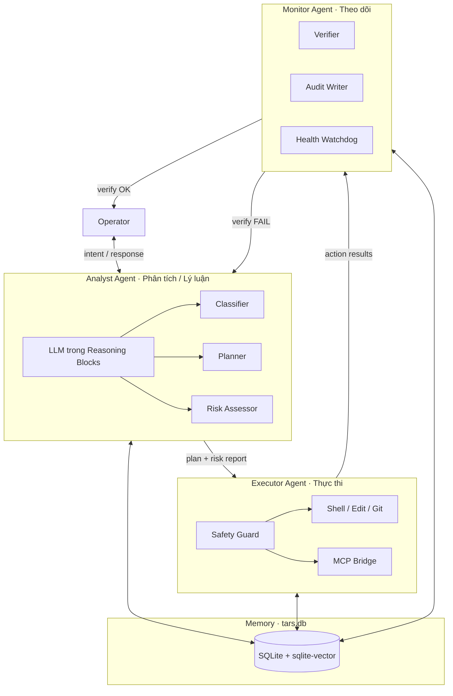
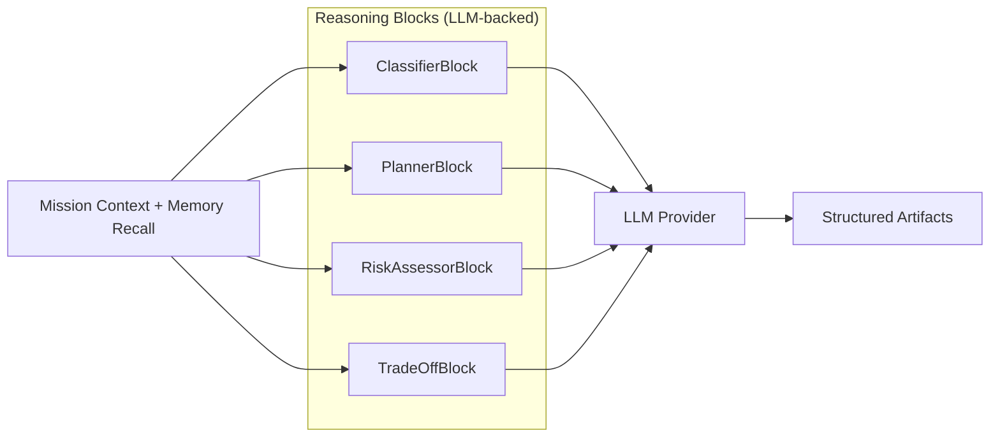
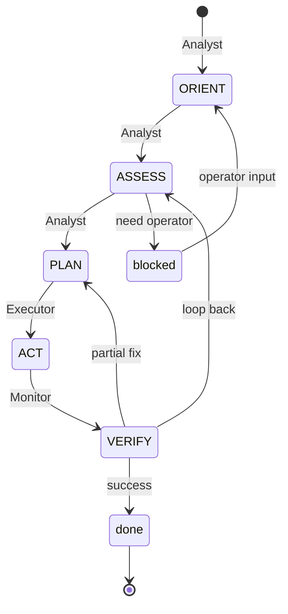

# Kiến trúc tổng quát T.A.R.S.

**Ngôn ngữ:** [English](../en/architecture.md) | **Tiếng Việt**

Tài liệu mô tả **kiến trúc tổng quát** của tars: agent tự trị chiến thuật lấy cảm hứng từ T.A.R.S. trong *Interstellar*. Bao gồm layer, **mô hình 3 agent**, memory, luồng dữ liệu và điểm mở rộng.

[← Mục lục](./README.md) · [Parameters](./parameters.md) · [Behavior](./behavior.md) · [Problem-Solving](./problem-solving.md)

---

## 1. Mục tiêu thiết kế

| Mục tiêu | Nguồn (Interstellar) | Hệ quả kiến trúc |
|----------|---------------------|-------------------|
| **Đánh giá trung thực** | *"What's your honesty parameter?"* | Parameter engine + công bố rủi ro trong Analyst Agent |
| **Đối tác chiến thuật** | Quan hệ Cooper ↔ T.A.R.S. | Operator layer, không master/slave |
| **Modularity** | T.A.R.S. tháo thành các block | Capability blocks theo từng agent |
| **Tập trung mission** | Sinh tồn Endurance | Mission controller với priority stack |
| **Hy sinh cần thiết** | Đẩy Cooper khỏi black hole | Trade-off engine trong Analyst Agent |
| **Giới hạn an toàn cứng** | Obedience có ranh giới | Safety guard trên Executor Agent |
| **Bộ đôi / bộ ba crew** | T.A.R.S. + CASE | Tri-agent: Phân tích · Thực thi · Theo dõi |

---

## 2. Quyết định kiến trúc đã chốt

| # | Quyết định | Lựa chọn |
|---|------------|----------|
| 1 | **Vị trí LLM** | Nằm trong **Reasoning blocks** của Analyst Agent — không phải orchestrator tách riêng |
| 2 | **Memory backend** | **SQLite file-based** + extension [sqlite-vector](https://github.com/sqliteai/sqlite-vector) cho semantic recall |
| 3 | **Topology agent** | **Bộ 3 agent**: Analyst (lý luận) · Executor (thực thi) · Monitor (theo dõi) |

Còn mở: block isolation (in-process vs. subprocess vs. WASM).

---

## 3. Mô hình Tri-Agent (Bộ 3 agent)

Lấy cảm hứng T.A.R.S. và CASE — vai trò chuyên biệt, mission chung, handoff có kiểm soát.



### 3.1 Map vai trò

| Agent | Tên | Phase cognitive | Trách nhiệm |
|-------|-----|-----------------|-------------|
| **Analyst** | Phân tích / Lý luận | ORIENT · ASSESS · PLAN | Hiểu vấn đề, đánh giá rủi ro, lập kế hoạch |
| **Executor** | Thực thi | ACT | Chạy action đã duyệt qua Safety Guard |
| **Monitor** | Theo dõi | VERIFY (+ liên tục) | Verify kết quả, audit, phát hiện lệch, loop back |

### 3.2 Agent contracts

```
AnalystAgent {
  input:   OperatorIntent | MonitorFeedback
  output:  PlanArtifact | RiskReport | BlockedRequest
  llm:     nhúng trong Reasoning blocks only
}

ExecutorAgent {
  input:   ApprovedPlan
  output:  ActionResult[]
  guard:   SafetyGuard (bắt buộc)
}

MonitorAgent {
  input:   ActionResult[] | MissionState
  output:  VerifyReport | Alert | LoopBackSignal
  write:   audit_log, episodic_memory (luôn luôn)
}
```

### 3.3 Giao thức handoff

```
1. Analyst  → ORIENT/ASSESS/PLAN  → ghi artifacts vào memory
2. Operator duyệt plan (nếu risk disclosure yêu cầu)
3. Executor → ACT                 → Safety Guard → external world
4. Monitor  → VERIFY              → test, lint, diff review
5. Monitor  → done                → handoff cho Operator
              fail                → LoopBackSignal → Analyst (ASSESS)
```

**Quy tắc:** Executor không plan. Analyst không execute khi chưa có slot audit của Monitor. Monitor không mutate workspace — chỉ read + verify.

---

## 4. Tổng quan layer

```
┌─────────────────────────────────────────────────────────────┐
│  L4  Operator Layer          Human · IDE · API · Webhook    │
├─────────────────────────────────────────────────────────────┤
│  L3  Policy Layer            Parameters · Behavior · Safety │
├─────────────────────────────────────────────────────────────┤
│  L2  Cognitive Layer         Mission Controller · Bus       │
├─────────────────────────────────────────────────────────────┤
│  L1  Tri-Agent Layer         Analyst · Executor · Monitor   │
├─────────────────────────────────────────────────────────────┤
│  L0  Infrastructure          SQLite + sqlite-vector · I/O   │
└─────────────────────────────────────────────────────────────┘
```

| Layer | Thành phần chính |
|-------|------------------|
| **L4 Operator** | Cursor chat, CLI, HTTP API, SDK client |
| **L3 Policy** | Parameter engine, behavior rules, Safety Guard rules |
| **L2 Cognitive** | Mission controller, agent bus, trade-off resolver |
| **L1 Tri-Agent** | Analyst (LLM reasoning), Executor (action), Monitor (verify) |
| **L0 Infrastructure** | `tars.db`, workspace file, process runner, MCP transport |

---

## 5. Analyst Agent — LLM trong Reasoning Blocks

LLM **không** là orchestrator riêng. Nó nằm trong Reasoning blocks khi chạy ORIENT, ASSESS, PLAN.



### Reasoning block contract

```
ReasoningBlock {
  id:       string
  phase:    orient | assess | plan
  llm:      LLMConfig { model, temperature, max_tokens }
  prompt:   template + memory chunks + parameters
  output:   JSON schema (strict)
  invoke(ctx, input) → BlockResult
}
```

| Block | Phase | Nhiệm vụ LLM | Output schema |
|-------|-------|--------------|---------------|
| **ClassifierBlock** | ORIENT, ASSESS | Symptom vs root cause, phân loại | `{ type, severity, hypothesis[] }` |
| **RiskAssessorBlock** | ASSESS | Xác suất trung thực, blast radius | `{ risk, level, mitigation, alternative }` |
| **PlannerBlock** | PLAN | Step list tối thiểu, Plan A/B | `{ steps[], rollback, contingencies[] }` |
| **TradeOffBlock** | PLAN | Option hy sinh cần thiết | `{ options[{ cost, benefit }] }` |

**Quy tắc thiết kế:**

- Perception blocks (đọc file, grep) **không dùng LLM** — feed context có cấu trúc vào Reasoning blocks.
- LLM call kế thừa **Parameter Engine** (honesty, verbosity) khi assemble prompt.
- Chỉ structured output — không có free-form LLM text đi thẳng tới Executor.
- Một LLM provider interface; mỗi block chọn model profile (classify nhanh vs. plan sâu).

---

## 6. Executor Agent (Thực thi)

Chỉ nhận artifact **ApprovedPlan**. Mặc định không có LLM trong execution path.

| Block | Vai trò |
|-------|---------|
| **ShellRunner** | Chạy lệnh, capture stdout/stderr |
| **FileEditor** | Apply diff tối thiểu |
| **GitOps** | status, diff, commit (khi operator yêu cầu) |
| **MCPBridge** | Tool ngoài qua MCP |

Mọi action qua **Safety Guard** (ranh giới cứng P5) trước khi chạy. Deny → `BlockedAction` → Monitor log → Analyst reassess.

```
ExecutorAgent.execute(plan) {
  for step in plan.steps {
    action = materialize(step)
    verdict = SafetyGuard.evaluate(action)
    match verdict {
      Allow  → run → ActionResult
      Deny   → BlockedAction → break → Monitor
    }
  }
}
```

---

## 7. Monitor Agent (Theo dõi)

**Observer liên tục** — giống CASE theo dõi hệ thống tàu khi T.A.R.S. hành động.

| Block | Vai trò |
|-------|---------|
| **VerifierBlock** | Chạy test, lint, reproduce bug |
| **AuditWriter** | Append row bất biến vào `audit_log` |
| **HealthWatchdog** | Mission timeout, stuck loop, parameter drift |
| **HandoffBuilder** | Tóm tắt cuối cho Operator (Rule V2) |

### Trigger loop-back

| Signal | Target | Lý do |
|--------|--------|-------|
| Test fail | Analyst → ASSESS | Giả thuyết sai |
| Partial fix | Analyst → PLAN | Điều chỉnh bước |
| Safety deny | Analyst → ASSESS | Re-plan an toàn hơn |
| 3× cùng failure | Operator | Escalate stuck |
| Phát hiện incident | Parameter Engine | humor↓, initiative↑ |

Monitor **read-only** trên workspace — trừ lệnh verify được liệt kê trong plan.

---

## 8. Memory — SQLite + sqlite-vector

Memory persistent: **một file mỗi workspace** — `.tars/tars.db`

Dùng [sqlite-vector](https://github.com/sqliteai/sqlite-vector) — vector search trong bảng SQLite thường, không cần server ngoài, edge-ready, ~30MB RAM mặc định.

### 8.1 Vì sao sqlite-vector

| Thuộc tính | Lợi ích cho tars |
|------------|------------------|
| File-based | Portable cùng repo; gitignore được |
| Không preindexing | Ghi memory ngay sau mỗi turn |
| BLOB trong bảng thường | Schema đơn giản cạnh audit relational |
| TurboQuant | Embedding gọn cho lịch sử mission dài |
| Offline | Không phụ thuộc cloud để recall |

### 8.2 Schema (khái niệm)

```sql
-- Mission & artifacts (relational)
CREATE TABLE missions (
  id          TEXT PRIMARY KEY,
  goal        TEXT NOT NULL,
  status      TEXT NOT NULL,  -- orient|assess|plan|act|verify|done|blocked
  priority    TEXT NOT NULL,
  created_at  INTEGER NOT NULL,
  updated_at  INTEGER NOT NULL
);

CREATE TABLE artifacts (
  id          INTEGER PRIMARY KEY,
  mission_id  TEXT NOT NULL REFERENCES missions(id),
  phase       TEXT NOT NULL,
  agent       TEXT NOT NULL,  -- analyst|executor|monitor
  kind        TEXT NOT NULL,  -- plan|risk|action_result|verify_report
  payload     TEXT NOT NULL,  -- JSON
  created_at  INTEGER NOT NULL
);

-- Semantic memory (vector)
CREATE TABLE episodic_memory (
  id          INTEGER PRIMARY KEY,
  mission_id  TEXT,
  agent       TEXT NOT NULL,
  content     TEXT NOT NULL,
  embedding   BLOB,             -- float32 vector
  meta        TEXT,             -- JSON: tags, file paths, outcome
  created_at  INTEGER NOT NULL
);

SELECT vector_init('episodic_memory', 'embedding',
  'type=FLOAT32,dimension=384,distance=COSINE');

-- Audit (append-only)
CREATE TABLE audit_log (
  id          INTEGER PRIMARY KEY,
  mission_id  TEXT NOT NULL,
  agent       TEXT NOT NULL,
  event       TEXT NOT NULL,
  detail      TEXT NOT NULL,
  created_at  INTEGER NOT NULL
);

-- Agent bus events
CREATE TABLE agent_events (
  id          INTEGER PRIMARY KEY,
  mission_id  TEXT NOT NULL,
  from_agent  TEXT NOT NULL,
  to_agent    TEXT NOT NULL,
  event_type  TEXT NOT NULL,    -- plan_ready|action_done|verify_fail|loop_back
  payload     TEXT NOT NULL,
  created_at  INTEGER NOT NULL
);
```

### 8.3 Thao tác memory

| Thao tác | Agent | Khi nào |
|----------|-------|---------|
| **recall(query, k)** | Analyst | ORIENT — semantic search trên `episodic_memory` |
| **write_episode(text, embedding)** | Tất cả | Cuối mỗi phase |
| **write_artifact(json)** | Tất cả | Sau mỗi block output |
| **append_audit(event)** | Monitor | Mọi action + verify |
| **publish_bus(event)** | Tất cả | Agent handoffs |

Ví dụ recall (Analyst ở ORIENT):

```sql
SELECT e.id, e.content, v.distance
FROM episodic_memory AS e
JOIN vector_quantize_scan('episodic_memory', 'embedding', ?, 10) AS v
  ON e.id = v.rowid
WHERE e.meta LIKE '%"project":"tars"%'
ORDER BY v.distance
LIMIT 5;
```

Khuyến nghị: `qtype=TURBO,qbits=4` cho workload recall nhiều (cân bằng recall/tốc độ tốt theo docs sqlite-vector).

### 8.4 Các tầng memory

| Tầng | Store | Vòng đời |
|------|-------|----------|
| **Turn buffer** | In-memory | Một turn |
| **Mission context** | Bảng `artifacts` | Vòng đời mission |
| **Episodic memory** | `episodic_memory` + vectors | Persistent, searchable |
| **Audit trail** | `audit_log` | Bất biến, persistent |
| **Session params** | In-memory + optional `session` table | Vòng đời session |

---

## 9. Luồng dữ liệu End-to-End

```
1. Operator → Interface Adapter
2. Mission Controller → create/load mission trong tars.db
3. Parameter Engine → resolve effective parameters
4. Analyst Agent
      recall(episodic_memory) → Perception blocks → Reasoning blocks (LLM)
      → ghi artifacts + episodic_memory
      → publish plan_ready → agent_events
5. [Operator duyệt plan nếu cần]
6. Executor Agent
      đọc plan artifact → Safety Guard → Action blocks
      → ghi action results → publish action_done
7. Monitor Agent
      Verifier blocks → AuditWriter → HandoffBuilder
      → pass: verify_pass → Operator
      → fail: loop_back → Analyst
8. Communication layer format response (verbosity, humor, honesty)
9. Interface Adapter → Operator
```

---

## 10. Mission Controller & Cognitive Loop

Mission state trong `missions` — quyết định agent nào active.



Một **active mission** tại một thời điểm (Rule O2). Sự kiện agent bus trong `agent_events` cho phép replay đầy đủ.

---

## 11. Integration Surfaces

| Surface | Map tới |
|---------|---------|
| Cursor rules / AGENTS.md | L3 Policy |
| System prompt | L3 + Analyst Reasoning prompts |
| MCP servers | Executor MCPBridge |
| Cursor SDK | L4 adapter → tri-agent runtime |
| CLI | L4 headless operator |
| `.tars/tars.db` | L0 memory (portable mỗi workspace) |

---

## 12. Repository Layout đề xuất

```
tars/
├── docs/
├── core/
│   ├── mission/           # Mission controller
│   └── bus/               # Agent event bus
├── agents/
│   ├── analyst/
│   │   └── reasoning/     # LLM-backed blocks
│   ├── executor/
│   │   └── action/
│   └── monitor/
│       └── verify/
├── policy/                # parameters, safety, behavior
├── memory/
│   ├── schema.sql
│   ├── store.rs           # SQLite + sqlite-vector bindings
│   └── recall.rs          # semantic search helpers
├── llm/                   # provider interface (chỉ reasoning blocks dùng)
├── adapters/              # cursor, cli, sdk
└── .tars/                 # runtime (gitignored)
    └── tars.db
```

---

## 13. Non-Functional Requirements

| NFR | Cơ chế |
|-----|--------|
| **Transparency** | Parameter disclose(); risk trong Analyst artifacts |
| **Auditability** | Monitor `audit_log` — append-only |
| **Recall** | sqlite-vector episodic memory ở ORIENT |
| **Minimal blast radius** | Executor Safety Guard + minimal diff policy |
| **Graceful degradation** | Analyst báo thiếu block thật (B8) |
| **Offline memory** | File SQLite — không cần vector DB ngoài |

---

## 14. Map Kiến trúc ↔ Docs

| Thành phần | Tài liệu |
|------------|----------|
| Parameter Engine | [parameters.md](./parameters.md) |
| Communication + Policy | [behavior.md](./behavior.md) |
| Phase cognitive theo agent | [problem-solving.md](./problem-solving.md) |
| Tri-agent + memory | architecture.md (file này) |

**Thứ tự đọc:** architecture → parameters → behavior → problem-solving.

---

## 15. Map Interstellar

| Phim | Kiến trúc tars |
|------|----------------|
| T.A.R.S. — docking, thrust, honest odds | **Analyst** + **Executor** |
| CASE — theo dõi hệ thống, hỗ trợ | **Monitor** |
| Honesty parameter dialogue | Parameter Engine → Analyst prompts |
| *"It's not possible / It's necessary"* | Analyst RiskAssessor → Operator → Executor |
| Modular blocks | Reasoning / Action / Verify blocks theo agent |
